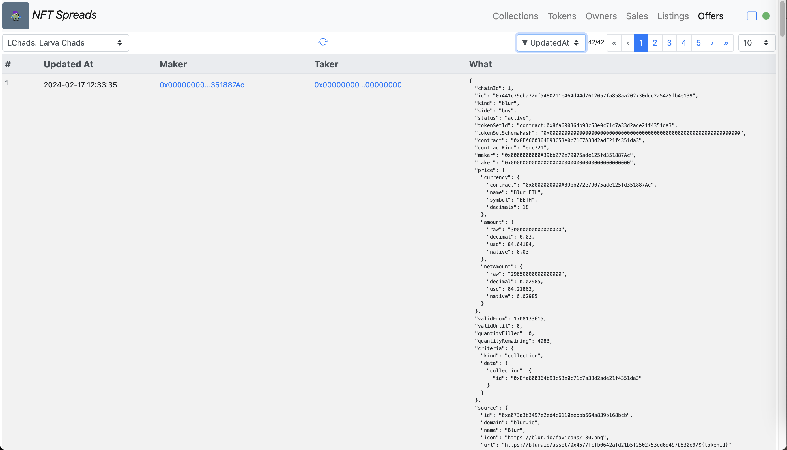

# NFT Spreads (WIP)

Web3 UI [https://bokkypoobah.github.io/NFTSpreads/](https://bokkypoobah.github.io/NFTSpreads/) connected to the Ethereum Mainnet

 

---

### Sample Screens

#### Collections

<kbd></kbd>

#### Tokens

Navigate to the Tokens page, select "LChads: Larva Chads" from the drop down, click the Sync button.

<kbd></kbd>

#### Owners

<kbd></kbd>

#### Sales

<kbd></kbd>

#### Listings

<kbd></kbd>

#### Offers

<kbd></kbd>

#### Tokens Filtered By Attributes And Owner

Filtered by `Bone Tone: Unbroken` and owner name including the text `vault`.

<kbd></kbd>

#### Tokens Filtered By TokenId Including Ranges

<kbd></kbd>

#### Tokens With Tags

<kbd></kbd>
